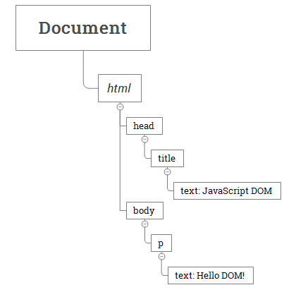

# JavaScript DOM
This section covers the JavaScript Document Object Model (DOM) and shows you how to manipulate DOM elements effectively.

## Document Object Model in JavaScript
The Document Object Model (DOM) is an application programming interface (API) for manipulating HTML documents.

The DOM represents an HTML document as a tree of nodes. The DOM provides functions that allow you to add, remove, and modify parts of the document effectively.

Note that the DOM is cross-platform and language-independent ways of manipulating HTML

### A document as a hierarchy of nodes
The DOM represents an HTML document as a hierarchy of nodes. Consider the following HTML document:

```html
<html>
    <head>
        <title>JavaScript DOM</title>
    </head>
    <body>
        <p>Hello DOM!</p>
    </body>
</html>
```



In this DOM tree, the document is the root node. The root node has one child node which is the `<html>` element. The `<html>` element is called the document element.

Each document can have only one document element. In an HTML document, the document element is the `<html>` element. Each markup can be represented by a node in the tree.

### Node and Element
Sometimes it’s easy to confuse between the Node and the Element.

A node is a generic name of any object in the DOM tree. It can be any built-in DOM element such as the document. Or it can be any HTML tag specified in the HTML document like `<div>` or `<p>`. 

An element is a node with a specific node type Node.ELEMENT_NODE, which is equal to 1.

In other words, the node is the generic type of element. The element is a specific type of the node with the node type Node.ELEMENT_NODE.

`Note:` that the getElementById() and querySelector() returns an object with the Element type while getElementsByTagName() or querySelectorAll() returns NodeList which is a collection of nodes. 

## Selecting Element
### JavaScript getElementById
The document.getElementById() method returns an Element object that represents an HTML element with an id that matches a specified string.

If the document has no element with the specified id, the document.getElementById() returns null.

Because the id of an element is unique within an HTML document, the `document.getElementById()` is a quick way to access an element.

The following shows the syntax of the `getElementById()` method:

```javascript
const element = document.getElementById(id);
```

In this syntax, the `id` is a string that represents the `id` of the element to select. The `id` is case-sensitive. For example, the `'root'` and `'Root'` are totally different.

### JavaScript getElementsByName
Every element on an HTML document may have a name attribute:

```html
<input type="radio" name="language" value="JavaScript">
```
Unlike the id attribute, multiple HTML elements can share the same value of the name attribute.

To get all elements with a specified name, you use the getElementsByName() method of the document object:

```javascript
let elements = document.getElementsByName(name);
```

The getElementsByName() accepts a name which is the value of the name attribute of elements and returns a live NodeList of elements.

The return collection of elements is live. It means that the return elements are automatically updated when elements with the same name are inserted and/or removed from the document.


### JavaScript getElementsByTagName
The getElementsByTagName() is a method of the document object or a specific DOM element.

The getElementsByTagName() method accepts a tag name and returns a live HTMLCollection of elements with the matching tag name in the order which they appear in the document.

Note that the HTMLCollection is an array-like object, like arguments object of a function.

### JavaScript getElementsByClassName
The getElementsByClassName() method returns an array-like of objects of the child elements with a specified class name. The getElementsByClassName() method is available on the document element or any other elements.

When calling the method on the document element, it searches the entire document and returns the child elements of the document:

```javascript
let elements = document.getElementsByClassName(names);
```

However, when calling the method on a specific element, it returns the descendants of that specific element with the given class name:

```javascript
let elements = rootElement.getElementsByClassName(names);
```
The method returns the elements which is a live HTMLCollection of the matches elements.

The names parameter is a string that represents one or more class names to match; To use multiple class names, you separate them by space.


### JavaScript querySelector
The querySelector() is a method of the Element interface. The querySelector() method allows you to select the first element that matches one or more CSS selectors.

The following illustrates the syntax of the querySelector() method:
```javascript
let element = parentNode.querySelector(selector);
```

In this syntax, the selector is a CSS selector or a group of CSS selectors to match the descendant elements of the parentNode.

If the selector is not valid CSS syntax, the method will raise a SyntaxError exception.

If no element matches the CSS selectors, the querySelector() returns null.

The querySelector() method is available on the document object or any Element object.

Besides the querySelector(), you can use the querySelectorAll() method to select all elements that match a CSS selector or a group of CSS selectors:

```javascript
let elementList = parentNode.querySelectorAll(selector);
```
The querySelectorAll() method returns a static NodeList of elements that match the CSS selector. If no element matches, it returns an empty NodeList.

Note that the NodeList is an array-like object, not an array object. However, in modern web browsers, you can use the forEach() method or the for...of loop.

To convert the NodeList to an array, you use the Array.from() method like this:

```javascript
let nodeList = document.querySelectorAll(selector);
let elements = Array.from(nodeList);
```

## Traversing the DOM
### JavaScript Get the Parent Element parentNode
To get the parent node of a specified node in the DOM tree, you use the parentNode property:

```javascript
let parent = node.parentNode;
```

sample code

```javascript
<body>
    <div id="main">
        <p class="note">This is a note!</p>
    </div>

    <script>
        let note = document.querySelector('.note');
        console.log(note.parentNode);
    </script>
</body>
```

### JavasScript Siblings